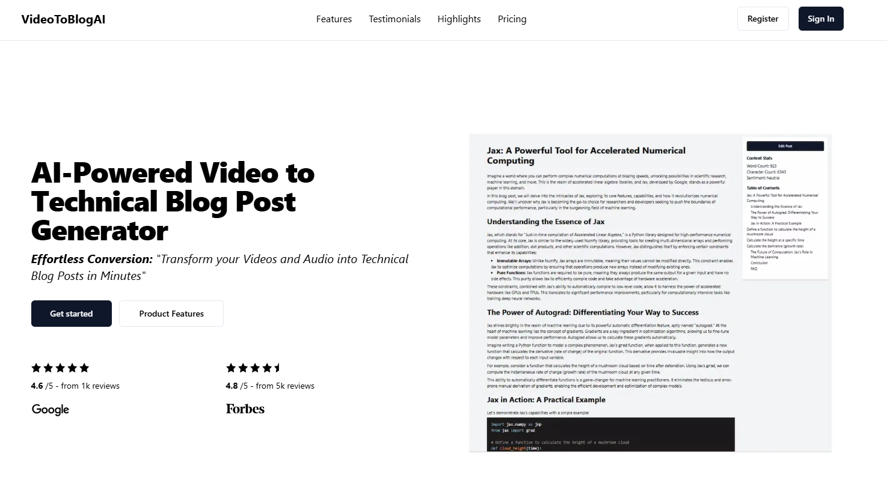
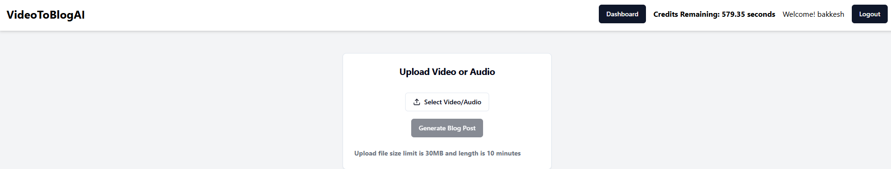
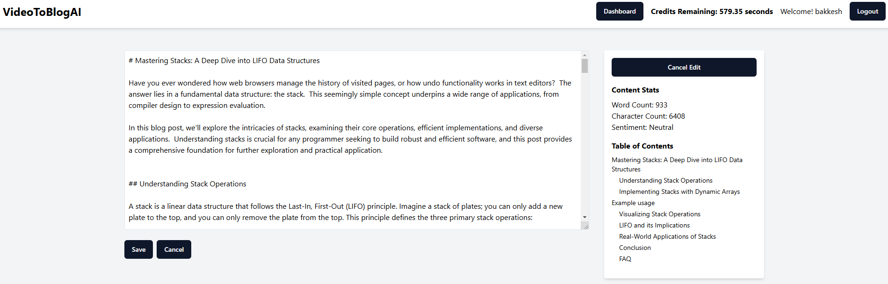

# Vlogify
## Project Proposal for the AssemblyAI Challenge
### Overview
Vlogify is a project designed to generate technical blog posts from various sources such as local videos, and audio files (with a 30 MB limit). It leverages the Google Gemini AI API for language model tasks and AssemblyAI API for speech-to-text functionality.






### Features

- **User registration and sign-in** with error handling.
- **Admin analytics**: blog post generation, total hours processed.
- **Content uploads**: MP4 videos, MP3 audio (max 30 MB).
- **Credit check**: Verify user credits before generating blog posts and manage available time for processing.
- **AI-generated blog posts**: view, edit, delete, save.
- **Automatic code extraction** from videos, audios and youtube url.
- **Features**: Word count, character count, dynamic table of contents, semantic analysis.
- **Rendering**: Markdown format with Next.js for a user-friendly interface.
- **Transcription services**:
  - Video/audio: AssemblyAI's speech-to-text API.
- **Google Gemini API**: Transform transcriptions into blog posts.

### Technologies Used

- **Frontend:** Next.js, Shadcn/UI, Tailwind CSS, Highlight.js
- **Backend:** Node.js, Express.js, MongoDB
- **AI APIs:** Google Gemini AI API (for language model tasks), AssemblyAI API (for speech-to-text)
- **Authentication:** JWT (JSON Web Tokens)

### Prerequisites

Make sure you have the following installed:

- Node.js (version 18 or higher)
- npm (Node Package Manager)
- MongoDB Installed Locally or Mongodb Cloud
- Google GeminiAI Api key & AssemblyAI Api key

## Setup Instructions

1. Clone the repository 
2. Navigate to the project directory.
3. Install dependencies using `npm install`.
4. Set up MongoDB and configure the connection string in the backend.
5. Obtain API keys for Google Gemini AI and AssemblyAI and configure them in the backend.
6. Run the backend server using `node app.js` (for development).
7. Run the frontend server using `npm run dev` in the `frontend` directory.
8. Access the application at `http://localhost:3000` in your web browser.

## Step1: Backend Installation

### Clone the Repository

Clone the TextTriangleAI repository from GitHub:

```bash
git clone https://github.com/your-username/Vlogify.git
```

```bash
cd Vlogify/backend
```

### Install Dependencies

Install the necessary dependencies using npm:

```bash
npm install
```

### Configuration (.env)

Add Gemini AI, AssemblyAI, JWT (random no) to a .env file in the root of the backend directory and add the following environment variables:

```bash
ASSEMBLYAI_API_KEY=your_assemblyai_api_key_here
GEMINIAI_API_KEY=your_geminiapi_api_key_here
JWT_SECRET=7c6f1f6e064d6f9f9f4b2e6faa1d57e4
MONGODB_URI=mongodb://localhost:27017/videotoblog
```

Adjust the values for ASSEMBLYAI_API_KEY, GEMINIAI_API_KEY, MONGODB_URI and JWT_SECRET with your actual API keys and JWT secret.

Make sure the MongoDB URI (uri) matches your local MongoDB setup or your cloud database URL.

### Running the Server

To run the backend server locally, use the following command:

```bash
node app.js
```

This starts the Node.js server.

### First Run Setup

When you first run the project, an admin user will be created automatically:

```bash
Username: admin@gmail.com
Password: Admin@1103
```

This is initialized by initializeAdmin.js located in the utils folder.

### Accessing Analytics

To access the /analytics route, you need to log in using the following credentials:

```bash
Username: admin@gmail.com
Password: Admin@1103
```

This route provides insights such as the number of users who generated blog posts, total hours processed, and other user metrics.

## Step2: Frontend Installation

```bash
cd Vlogify/frontend
```

### Install Dependencies

Install the necessary dependencies using npm:

```bash
npm install
```

### Configuration

Add url to .env file in the root of the frontend directory and add the following content:

```bash
NEXT_PUBLIC_API_BASE_URL=http://localhost:3000
```

This sets the base URL for API requests. Adjust NEXT_PUBLIC_API_BASE_URL if your backend server runs on a different port or domain.

### Running the Development Server

To run the development server locally, use the following command:

```bash
npm run dev
```

This starts the Next.js development server on http://localhost:3000.

### Building for Production

To build the project for production, run:

```bash
npm run build
```

This command builds the application for production usage. You can then deploy the contents of the out directory to your hosting provider.

### Additional Notes

- Ensure that API rate limits and usage quotas are respected to avoid service interruptions.
- I had used Google Gemini 1.5 Flash for Text Generation (Rate Limit Free tier: 15 Request & 1 million token per minute)
- I had used AssemblyAI speech to text api to transcribe media into text (Rate Limit Free Account: 5 concurrent users and 100 Hours free transcribe of speech to text api for free account).
- This project is developed with handling small number of users not suitable for production

### Contributors

- [bakkeshks](https://github.com/bakkeshks)

### License

This project is licensed under the [MIT] License - see the LICENSE file for details.